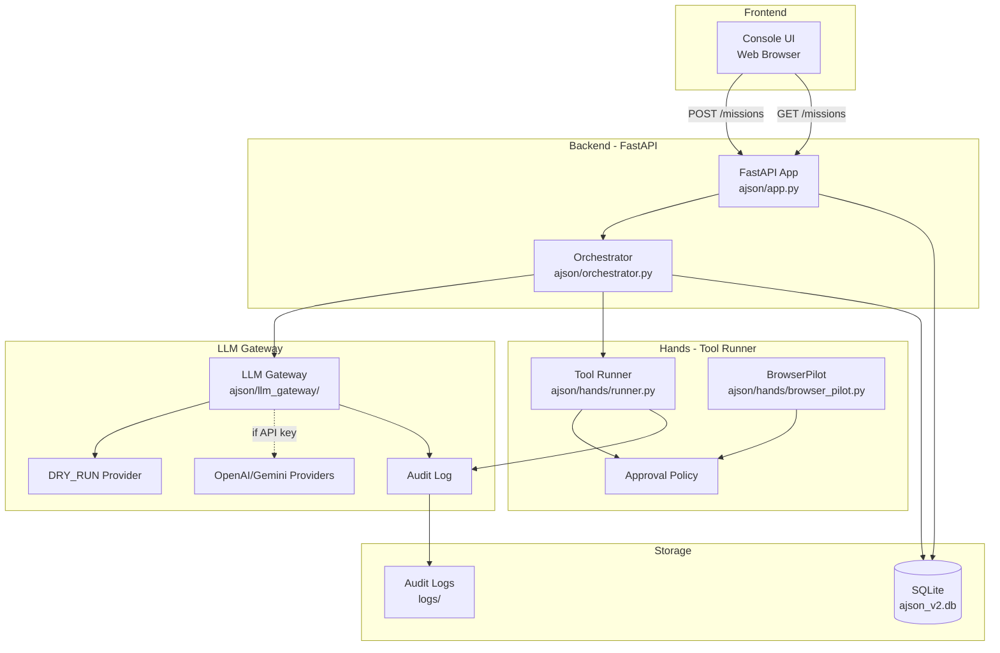
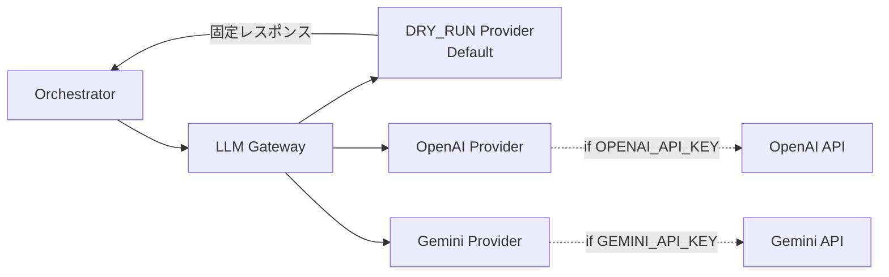
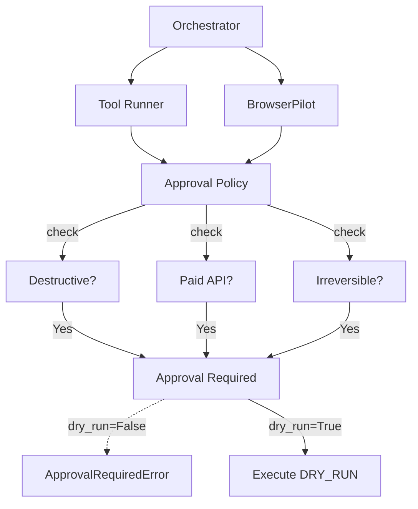

# AJSON Architecture

**タイムスタンプ**: 2026-02-07T00:35:00+09:00（Asia/Tokyo）  
**バージョン**: 0.7.0-dev（Phase 8実装中）

---

## Overview

AJSON (Agent-driven JSON Orchestration System) は、LLM-powered ミッション実行システムです。
DRY_RUNモードをデフォルトとし、セキュアなAPI key管理、承認ゲート、監査ログを備えています。



---

## Core Components

### 1. Console UI (Web Frontend)

**Path**: `ajson/app.py` (inline HTML/JS/CSS)  
**Purpose**: Mission実行のためのWeb UI

**Features**:
- Mission作成・実行
- Message送受信（user/assistant）
- Voice入力（Web Speech API）
- Attachment（今後）
- 🧾 LLMトレース閲覧

**Mobile-first Design** (Phase 3 Lite):
- Composer拡大（sticky bottom、viewport基準高さ）
- iOS safe-area対応
- 返答可視化（DRY_RUNでもassistant応答表示）

---

### 2. LLM Gateway

**Path**: `ajson/llm_gateway/`  
**Purpose**: LLM API呼び出しの抽象化レイヤー



**Key Files**:
- `base.py`: BaseProvider抽象クラス
- `dry_run.py`: DRY_RUNモック実装
- `openai_provider.py`: OpenAI統合
- `gemini_provider.py`: Gemini統合
- `keychain.py`: macOS Keychainからのセキュアなキー取得
- `audit.py`: LLMイベント監査ログ

**Secure API Key Handling** (Phase 2):
- macOS Keychainからの自動取得
- 環境変数フォールバック
- マスク表示のみ（`sk-****...****`）
- リポジトリにAPIキー値は絶対含めない

---

### 3. Hands - Tool Runner & BrowserPilot

**Path**: `ajson/hands/`  
**Purpose**: ツール実行と承認ゲート



**Key Files**:
- `policy.py`: ApprovalPolicy、承認要否判定
- `runner.py`: Tool Runner（Command実行、DRY_RUNデフォルト）
- `browser_pilot.py`: ブラウザ操作（DRY_RUNデフォルト、secret masking）

**Approval Policy**:
- DESTRUCTIVE: `rm -rf`, `git push --force`, `DROP DATABASE`
- PAID: `openai.ChatCompletion`, `anthropic.Completion`
- IRREVERSIBLE: `git merge main`, `git tag`, `npm publish`

**Phase 8 Status** (DRY_RUN skeleton):
- ✅ Tool Runner: 基本実装、approval gates、audit log
- ✅ BrowserPilot: navigate/click/type_text、secret masking
- ⏳ 実実行: 承認後に実装予定

---

### 4. Orchestrator

**Path**: `ajson/orchestrator.py`  
**Purpose**: ミッション実行の状態管理とフロー制御

**State Machine**:
```
CREATED → RUNNING → DONE
    ↓
PENDING_APPROVAL → (Manual Approval) → RUNNING
    ↓
FAILED
```

**Key Responsibilities**:
- ミッション状態遷移
- LLM Gateway呼び出し
- Tool Runner呼び出し
- 承認ゲート検出

---

### 5. Database (SSOT)

**Path**: `ajson_v2.db` (SQLite)  
**Purpose**: Single Source of Truth

**Tables**:
- `missions`: ミッション（ID, status, created_at, ...）
- `messages`: メッセージ（ID, mission_id, role, content, ...）
- `approvals`: 承認要求（今後実装予定）

---

## Security & Compliance

### Lint & Validation

**Path**: `scripts/lint_forbidden_strings.sh`  
**Purpose**: 禁止パターン検出（pre-commit/CI）

**Checks**:
- `file://` scheme（絶対パス禁止）
- `/Users/`, `/home/`（絶対パス禁止）
- APIキーパターン（`sk-*`, `AIza*`）
- force pushコマンド

**Integration**:
- `conftest.py`: pytest実行前に自動Lint
- `.github/workflows/lint.yml`: CI/CD統合

---

### Audit Logging

**Path**: `logs/audit.log`, `ajson/llm_gateway/audit.py`  
**Purpose**: 全操作の監査ログ

**Logged Events**:
- LLM API呼び出し（プロンプト、レスポンス、使用量）
- Tool実行（コマンド、結果、DRY_RUN flag）
- Browser操作（URL、selector、secret-masked text）

**Secret Masking**:
- APIキー: `sk-****...****`
- パスワード: `password=***MASKED***`
- URL credentials: 自動マスク

---

## Development Workflow

### Local Development

```bash
# 環境セットアップ
python -m venv venv
source venv/bin/activate
pip install -r requirements.txt

# Lint + pytest
./scripts/lint_forbidden_strings.sh
pytest -q

# サーバー起動
uvicorn ajson.app:app --reload --port 8000
```

### Branch Strategy

- `main`: 安定版
- `ui-console-ux-v2-lite`: Phase 3 UI改善
- `phase8-hands-scaffold`: Phase 8 Hands実装
- `ops/*`: 運用改善（boot rules、keychain等）

### CI/CD

GitHub Actions: `.github/workflows/lint.yml`
- Lint実行（禁止文字列チェック）
- pytest実行
- 全PR/pushで自動実行

---

## Future Roadmap

### Phase 8 - Hands (in progress)

- [ ] Tool Runner実実行（allowlist/denylist）
- [ ] BrowserPilot実実行（Playwright統合）
- [ ] Screenshot証跡自動取得

### Phase 9 - Advanced UI

- [ ] E2E test追加
- [ ] Coverage測定・バッジ
- [ ] Performance測定

### Phase 10 - Production Ready

- [ ] Security audit（bandit, safety）
- [ ] Type hints追加（mypy --strict）
- [ ] Changelog自動生成

---

## References

- [Task Queue SSOT](../docs/ants_queue.md)
- [Phase 8 Plan](../docs/phase8_hands_plan_lite.md)
- [Secure API Key Handling](../docs/secure_api_key_handling.md)
- [PR #1: Console UX v2 Lite](https://github.com/office-n/ajson-proto/pull/1)
- [PR #4: Phase 8 Hands Scaffold](https://github.com/office-n/ajson-proto/pull/4)
