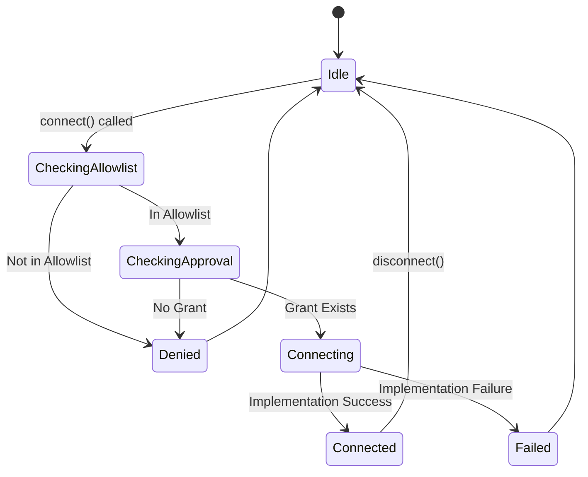

# Phase 9.8.1 Design: Allowlist + Approval + Evidence

## 概要
ネットワーク接続(Realtime API)における「実通信ゼロ」の原則を論理的・物理的に保証するため、
**Allowlist + Approval + Evidence** の3層防御を実装する。

## 1. 3層防御アーキテクチャ

### Layer 1: Allowlist (静的許可リスト)
- **役割**: 接続先ホスト/ポートの事前定義。これに含まれない接続は即時拒否。
- **実装**: `ajson/hands/allowlist.py` (File/Env base)
- **構成**:
  - `allowed_hosts`: List[str] (e.g., `["api.openai.com", "cdn.openai.com"]`)
  - `allowed_ports`: List[int] (e.g., `[443]`)

### Layer 2: Approval (動的承認)
- **役割**: 実行時の動的許可。Allowlist通過後、さらにApproval Gateを通る必要がある。
- **実装**: `ajson/hands/approval_sqlite.py` (Existing)
- **フロー**:
  1. Connection Request (Host, Port, Reason)
  2. Check existing `ApprovalGrant` (Active & Not Expired)
  3. If no grant -> Raise `ApprovalRequiredError`

### Layer 3: Evidence (証跡記録)
- **役割**: 全接続試行の記録。拒否/許可に関わらず全て記録し、後から監査可能にする。
- **実装**: `ajson/hands/audit_logger.py` (Existing)
- **Event Types**:
  - `network.connect.attempt`: 接続試行
  - `network.connect.allowed`: 許可
  - `network.connect.denied`: 拒否 (Reason含む)

## 2. 接続シーケンス (State Machine)

`NetworkConnector` クラスにて以下の状態遷移を管理する。

## 3. 実装方針
- **NetworkAdapter**: インターフェース定義
- **SecureConnector**: 上記3層防御を実装した具象クラス
- **Mock**: テスト用

## 4. 検証 (Mock Contract)
- 実際のネットワーク通信は行わず、`SecureConnector` のロジックのみをテストする。
- TestCase:
  - `test_connect_denied_by_allowlist`: Allowlist外への接続 -> `NetworkDeniedError`
  - `test_connect_denied_by_approval`: Approvalなし -> `ApprovalRequiredError`
  - `test_connect_allowed`: 両方Pass -> `Connected` (Mock)
