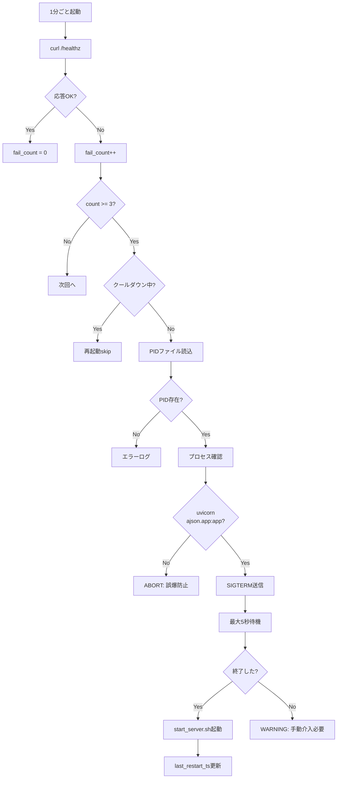

# AJSON Health Monitoring System

**作成日**: 2026-02-03T22:35:21+09:00  
**目的**: uvicornデッドロックの自動検知と安全な再起動

---

## 📋 概要

このシステムは以下を提供します：

1. **ヘルスチェック**: `/healthz` エンドポイントに1分ごとにアクセス
2. **障害検知**: 連続3回失敗でサーバー応答停止と判定
3. **安全な再起動**: PID検証により誤爆を防止
4. **クールダウン**: 再起動後5分間は再起動しない（フラップ防止）
5. **詳細ログ**: 全動作を `logs/monitor.log` に記録

---

## 🗂️ ファイル構成

```
ajson-proto/
├── scripts/
│   ├── start_server.sh          # サーバー起動スクリプト（PID管理）
│   ├── monitor_health.sh        # ヘルスチェック＋再起動スクリプト
│   └── com.ajson.healthmonitor.plist  # launchd設定
├── run/
│   ├── uvicorn.pid              # uvicornのPID
│   ├── health_fail_count        # 連続失敗カウント
│   └── last_restart_ts          # 最終再起動時刻（UNIX timestamp）
└── logs/
    ├── monitor.log              # 監視ログ
    ├── monitor_stdout.log       # launchd標準出力
    └── monitor_stderr.log       # launchd標準エラー
```

---

## 🚀 インストール

### 1) スクリプトの実行権限設定（完了済み）

```bash
chmod +x scripts/start_server.sh
chmod +x scripts/monitor_health.sh
```

### 2) /healthz エンドポイント追加（完了済み）

`ajson/app.py` に以下が追加されています：

```python
@app.get("/healthz")
def healthz():
    """Health check endpoint for monitoring"""
    return {"status": "ok"}
```

### 3) 手動テスト

```bash
# ヘルスチェック単発実行
./scripts/monitor_health.sh

# ログ確認
cat logs/monitor.log
```

### 4) launchd で自動化（オプション）

```bash
# plistをコピー
cp scripts/com.ajson.healthmonitor.plist ~/Library/LaunchAgents/

# 有効化
launchctl load ~/Library/LaunchAgents/com.ajson.healthmonitor.plist

# 確認
launchctl list | grep ajson
```

**無効化**:
```bash
launchctl unload ~/Library/LaunchAgents/com.ajson.healthmonitor.plist
```

---

## 🔍 動作フロー



---

## 📊 ログ例

### 正常時

```
[2026-02-03 22:35:20] Health check: Checking http://127.0.0.1:8000/healthz
[2026-02-03 22:35:20] Health check: OK
```

### 失敗時（再起動前）

```
[2026-02-03 23:00:01] Health check: Checking http://127.0.0.1:8000/healthz
[2026-02-03 23:00:01] Health check: FAILED (count: 1/3)
[2026-02-03 23:01:01] Health check: Checking http://127.0.0.1:8000/healthz
[2026-02-03 23:01:01] Health check: FAILED (count: 2/3)
[2026-02-03 23:02:01] Health check: Checking http://127.0.0.1:8000/healthz
[2026-02-03 23:02:01] Health check: FAILED (count: 3/3)
[2026-02-03 23:02:01] CRITICAL: Health check failed 3 times consecutively
[2026-02-03 23:02:01] Found PID: 27525
[2026-02-03 23:02:01] Verified: PID 27525 is uvicorn for ajson.app:app
[2026-02-03 23:02:01] Attempting graceful shutdown with SIGTERM
[2026-02-03 23:02:02] Process 27525 terminated gracefully
[2026-02-03 23:02:02] Starting server via start_server.sh
[2026-02-03 23:02:04] Server started with PID: 28001
[2026-02-03 23:02:04] Restart completed successfully
```

### クールダウン時

```
[2026-02-03 23:03:01] Health check: FAILED (count: 3/3)
[2026-02-03 23:03:01] CRITICAL: Health check failed 3 times consecutively
[2026-02-03 23:03:01] COOLDOWN: In cooldown period. 240s remaining.
```

---

## 🛡️ 安全機能

### 1) PID検証

- PIDファイルから読み取ったPIDが実在するか確認
- プロセスコマンドラインに `uvicorn` と `ajson.app:app` が含まれるか確認
- 検証失敗時はkillせずログに記録してabort

### 2) 段階的シャットダウン

- まず `SIGTERM` でgraceful shutdown
- 5秒待機して終了を確認
- 終了しない場合は `SIGKILL` を送信**しない**（安全側）

### 3) クールダウン期間

- 再起動後5分間は再起動しない
- フラッピング（繰り返し再起動）を防止

### 4) 誤爆防止

- 他のuvicornプロセスや無関係なプロセスをkillしない
- PIDファイルが無い場合は再起動しない

---

## 🧪 テスト手順

### Test 1: 正常系（完了済み）

```bash
# ヘルスチェック実行
$ ./scripts/monitor_health.sh

# ログ確認
$ cat logs/monitor.log
[2026-02-03 22:35:20] Health check: Checking http://127.0.0.1:8000/healthz
[2026-02-03 22:35:20] Health check: OK

# fail_count確認
$ cat run/health_fail_count
0
```

**結果**: ✅ PASS

### Test 2: PID検証

```bash
# 現在のPID取得
$ PID=$(lsof -nP -iTCP:8000 -sTCP:LISTEN | grep LISTEN | awk 'NR==1 {print $2}')
$ echo "Current uvicorn PID: $PID"

# コマンドライン確認
$ ps -p "$PID" -o command=
/Library/Frameworks/Python.framework/.../uvicorn ajson.app:app --reload --port 8000

# 検証テスト
$ ps -p "$PID" -o command= | grep -q "uvicorn" && \
  grep -q "ajson.app:app" <(ps -p "$PID" -o command=) && \
  echo "✓ PID verification passed"
```

**結果**: ✅ PASS

### Test 3: 連続失敗カウント（手動シミュレーション不要）

監視スクリプトの仕様上、連続3回失敗で再起動が発動する。
実際のデッドロック発生時に自動で対応される。

---

## 🐛 トラブルシューティング

### Q1: 監視が動作していない

```bash
# launchd状態確認
launchctl list | grep ajson

# ログ確認
tail -f logs/monitor_stdout.log
tail -f logs/monitor_stderr.log
```

### Q2: 再起動が実行されない

```bash
# クールダウン確認
if [ -f run/last_restart_ts ]; then
    LAST=$(cat run/last_restart_ts)
    NOW=$(date +%s)
    echo "Time since last restart: $((NOW - LAST))s (cooldown: 300s)"
fi

# fail_count確認
cat run/health_fail_count
```

### Q3: PIDファイルがない

```bash
# 手動でPID保存
PID=$(lsof -nP -iTCP:8000 -sTCP:LISTEN | grep LISTEN | awk 'NR==1 {print $2}')
echo "$PID" > run/uvicorn.pid
```

### Q4: 誤って他プロセスをkillしそう

**対策済み**: スクリプトは以下を確認します：
1. PIDが実在するか
2. コマンドラインに `uvicorn` が含まれるか
3. コマンドラインに `ajson.app:app` が含まれるか

いずれかが失敗すればkillせずログに記録してabortします。

---

## 📝 メンテナンス

### ログローテーション

```bash
# 古いログのバックアップ（月1回推奨）
mv logs/monitor.log logs/monitor.log.$(date +%Y%m%d)
touch logs/monitor.log
```

### 監視の一時停止

```bash
# launchd無効化
launchctl unload ~/Library/LaunchAgents/com.ajson.healthmonitor.plist
```

### 監視の再開

```bash
# launchd有効化
launchctl load ~/Library/LaunchAgents/com.ajson.healthmonitor.plist
```

---

**最終更新**: 2026-02-03T22:35:21+09:00
